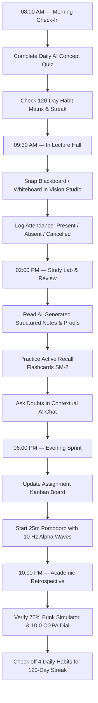

# 🎓 Scholar OS — Cognitive Academic Operating System

<div align="center">


[](https://nextjs.org/)
[](https://www.typescriptlang.org/)
[](https://tailwindcss.com/)
[](https://deepmind.google/technologies/gemini/)
[](https://scholardashboard.vercel.app)
[](https://developers.google.com/identity)
[](LICENSE)

**A unified, cloud-synced academic intelligence operating system built for university students, researchers, and engineers: digitize live classroom blackboards into structured notes, take syllabus-grounded daily AI concept quizzes with active recall flashcards, simulate 75% attendance thresholds, plan 10.0 CGPA trajectories, and cultivate 120-day cognitive study streaks.**

[🚀 Open Live App](https://scholardashboard.vercel.app) · [🧭 Dashboard Component Map](#-dashboard-component-map--which-part-does-what) · [📖 Step-by-Step Usage Guide](#-detailed-step-by-step-usage-guide) · [🔄 Daily Workflow](#-end-to-end-workflow-a-day-with-scholar-os) · [🛠️ Tech Stack & Setup](#-technical-stack--local-setup)

</div>

---

## 🌟 Overview & Problem Statement

University students and researchers often juggle 5 to 7 fragmented tools every day: one for note-taking, another for attendance calculation, third-party flashcard apps, habit trackers, Pomodoro timers, and assignment sheets. This causes cognitive overload, lost lecture context, and missed academic deadlines.

**Scholar OS** solves this by unifying your entire academic workflow into a single, high-performance, real-time operating system. Every module is purpose-built and interconnected: your classroom whiteboard snapshots automatically generate flashcards, flashcards feed into your daily professor check-in, and quiz completions reinforce your 120-day cognitive habit streak.

---

## 🧭 Dashboard Component Map — Which Part Does What?

To help new users navigate Scholar OS effortlessly, here is the complete breakdown of every section, its exact role, and which component to use for your specific academic goals:

| Module / Component | Primary Purpose | When & Why to Use It | Key Output / Benefit |
| :--- | :--- | :--- | :--- |
| 📸 **Vision Studio & Blackboard AI**<br>`src/components/vision/` | Physical-to-digital classroom digitization | During/after lectures to snap blackboard photos, lab sheets, and assignment PDFs | Structured Markdown notes, step-by-step derivations, SM-2 flashcards, and AI doubt tutor |
| 🎯 **Daily AI Concept Quiz**<br>`src/components/tutor/` | Syllabus-grounded daily oral & written testing | Every morning or study session to test retention and avoid cramming | Strict deterministic grading, speech synthesis, remediation flashcards, and habit attribution |
| 🎓 **Attendance Tracker & Bunk Simulator**<br>`src/components/academic/AttendanceTracker` | Enforce 75% attendance threshold | Daily before/after lectures to log classes and avoid exam disqualification | Exact safe skips counter, consecutive deficit recovery calculation, and status badges |
| 📈 **10.0 CGPA Benchmark Engine**<br>`src/components/academic/CgpaProgressRing` | Academic trajectory & honors planning | Semester planning to project required grades for target honors CGPA | Required future SGPA calculator, visual progress dial, and semester history tracker |
| 📋 **Assignment Kanban Board**<br>`src/components/academic/AssignmentKanban` | Milestone & deliverable management | Managing homework, lab assignments, project deliverables, and exams | 4-stage Kanban (`Backlog` ➔ `In Progress` ➔ `Review` ➔ `Done`) with priority badges |
| 🌿 **120-Day Habit Heatmap**<br>`src/components/habits/` | Long-term consistency & discipline | Daily 1-tap check-in across Deep Study, Coding, Attendance, and Health | GitHub-style 120-day heatmap, consecutive streak records, and discipline tracking |
| ⏱️ **Focus Studio & Binaural Synthesizer**<br>`src/components/audio/` | Deep work sprints without distraction | During intense study sessions to block external noise and enter flow | Pomodoro timer (25/5/15m) + Web Audio synth (Alpha 10Hz, Brown Noise, Rain, Flow Tones) |
| ☁️ **Cloud Sync & Identity Hub**<br>`src/components/auth/` | Cross-device real-time sync & profile | Automatic sync between mobile in class and laptop at desk | Instant data parity, Google OAuth login, zero mock-data clean slate |

---

## 📖 Detailed Step-by-Step Usage Guide

Below is an in-depth walkthrough of each module with step-by-step instructions for getting maximum value out of Scholar OS.

```
+-----------------------------------------------------------------------------------+
|                                 SCHOLAR OS HUD                                    |
+-----------------------------------------------------------------------------------+
|  [📸 Blackboard Vision]  |  [🎯 Daily AI Quiz]  |  [🎓 75% Attendance & Bunk Sim] |
|  - Snap lecture board    |  - Oral / MCQ check  |  - Log Present / Absent         |
|  - AI Notes & Derivation |  - Strict evaluation |  - Safe Skips / Recovery calc   |
|  - Flashcard Decks       |  - Voice synthesizer |  - Prevent debarment            |
+--------------------------+----------------------+---------------------------------+
|  [📈 10.0 CGPA Engine]   |  [📋 Kanban Sprint]  |  [🌿 120-Day Habit Matrix]      |
|  - Honors Target Dial    |  - Backlog to Done   |  - Deep Study (4h)              |
|  - Required SGPA Calc    |  - Course-linked     |  - Coding & Problem Solving     |
|  - Historical Trends     |  - Priority alerts   |  - Attendance & Hydration       |
+-----------------------------------------------------------------------------------+
|                     [⏱️ Deep Work Studio & Ambient Audio Engine]                  |
|                 Pomodoro Sprints (25m/5m) + Alpha Waves (10 Hz)                   |
+-----------------------------------------------------------------------------------+
```

---

### 📸 1. Classroom Blackboard & Assignment Vision Studio
> **File Location**: `src/components/vision/`  
> **Target Need**: Digitizing messy chalkboard formulas, complex lecture derivations, lab worksheets, and handwritten notes into high-yield digital study materials.

#### ✨ What it does:
- **Optical & Vision AI Analysis**: Leverages Google Gemini 2.5 Flash to inspect handwritten or photographed lecture boards.
- **Hierarchical Structured Notes**: Extracts main concepts, definitions, formulas, and code snippets into clean formatted markdown.
- **Step-by-Step Derivation Breakdown**: Deconstructs multi-step mathematical proofs, algorithm traces, and circuit diagrams into logical phases.
- **Automated Spaced-Repetition Flashcards**: Creates interactive SM-2 flashcard decks directly from the lecture material.
- **Contextual AI Chat Drawer**: A dedicated tutor that answers specific questions about that exact board snapshot with zero hallucination.
- **Lecture History Shelf**: Saves every analyzed board with course tags, search, and date filters for rapid exam revision.

#### 📝 Step-by-Step Instructions:
1. **Open Vision Studio**: Click on the **Classroom Blackboard Vision** card or tap the camera icon in the mobile navigation.
2. **Capture or Upload**:
   - *On Mobile*: Tap **"Capture Live Board"** to open your native camera and snap the lecture board.
   - *On Desktop*: Click **"Upload Lecture Snapshot"** or drag-and-drop an image (`PNG`, `JPG`, `WEBP`) or select one of the pre-loaded academic samples.
3. **Select Course Tag**: Assign the image to your course code (e.g., `[CS301] Data Structures`, `[MATH201] Linear Algebra`, `[DBMS] Database Systems`).
4. **Click "Analyze Blackboard"**: The AI processes the image in ~2-3 seconds.
5. **Study the Generated Artifacts**:
   - **Notes Tab**: Read structured summaries and copy code blocks or LaTeX formulas.
   - **Derivations Tab**: Follow numbered step-by-step logic chains for complex proofs.
   - **Flashcards Tab**: Flip cards to test your recall and rate difficulty (`Again`, `Hard`, `Good`, `Easy`).
   - **Chat Tab**: Ask follow-up questions like *"Explain line 3 in simpler terms"* or *"Write a Python script for this algorithm"*.
6. **Save to History Shelf**: The board is automatically archived in your **Board History Shelf** for quick search before midterms or finals.

---

### 🎯 2. Daily AI Concept Quiz & Active Recall Studio
> **File Location**: `src/components/tutor/DailyProfessorOralCheckin.tsx`  
> **Target Need**: Daily cognitive retention testing to ensure deep understanding of coursework without last-minute cramming.

#### ✨ What it does:
- **Coursework-Grounded Synthesis**: Generates targeted concept questions directly from your active enrolled subjects and uploaded lecture boards.
- **Audio Voice Recitation**: Web Speech API integration reads out questions, choices, and explanations for an authentic oral check-in experience.
- **Dual Response Modes**: Supports rapid **Multiple-Choice Assessment** as well as in-depth **Written Explanation Recall**.
- **Strict Deterministic Grading**: Eliminates score inflation. Wrong answers receive a strict `Grade: F` (`Mastery Score: 0%`) and automatically flip open an Active Recall Flashcard with the full ground-truth solution and memory hints.
- **Streak & Focus Integration**: Correct answers contribute to your Honors CGPA trajectory and offer a 1-tap launch into a 25-minute Pomodoro study sprint.

#### 📝 Step-by-Step Instructions:
1. **Launch Daily Check-In**: Open the **Daily AI Oral Check-In** panel from your dashboard.
2. **Select Target Subject**: Choose which subject to test (e.g., *Operating Systems*, *Discrete Math*, *Machine Learning*).
3. **Configure Settings**:
   - Toggle **Audio Voice** on/off based on your environment.
   - Select **Multiple Choice** for quick evaluation or **Written Recall** for deeper active recall.
4. **Answer the Question**:
   - For MCQ: Select the most accurate option.
   - For Written: Type your conceptual breakdown into the response box.
5. **Submit & Review**:
   - View your deterministic grade and feedback breakdown.
   - If incorrect, study the **Remediation Flashcard** displaying memory anchors, formulas, and why the mistake occurred.
6. **Trigger Flow Sprint**: Click **"Launch 25m Focus Block"** to immediately begin studying related weak areas.

---

### 🎓 3. Course Attendance & 75% Bunk Simulator
> **File Location**: `src/components/academic/AttendanceTracker.tsx`  
> **Target Need**: Keeping attendance safely above mandatory university thresholds (e.g. 75% minimum) and avoiding semester debarment.

#### ✨ What it does:
- **Subject-Wise Tracking**: Keeps separate tallies for attended, missed, and cancelled lectures across all enrolled courses.
- **Real-Time Percentage Dial**: Displays precise current attendance percentages with high-contrast color indicators (Green ≥ 75%, Amber 70-74%, Red < 70%).
- **Safe Bunk Calculator**: Calculates the exact number of future lectures you can safely miss while keeping your percentage at or above 75.0%.
- **Deficit Recovery Calculator**: If attendance drops below 75%, instantly computes the exact streak of consecutive upcoming classes you must attend to recover.
- **Zero False Defaults**: Starts clean at `0/0 (0%)` for new courses without deceptive placeholder statistics.

#### 📝 Step-by-Step Instructions:
1. **Add Your Courses**: Click **"+ Add Course"** and enter Course Name, Code (e.g., `CS302`), Total Credits, and Target Threshold (default: `75%`).
2. **Log Daily Classes**: After every lecture, tap one of three buttons:
   - `+ Present`: Increments attended and total classes (+1 attended, +1 total).
   - `+ Absent`: Increments missed and total classes (+0 attended, +1 total).
   - `+ Cancelled`: Records class cancellation without penalizing your percentage.
3. **Check the Bunk Simulator**:
   - If you see `Safe to Miss: 4 classes`, you have attendance buffer.
   - If you see `Deficit Alert: Attend next 6 classes consecutively`, prioritize attending every session until the warning clears.

---

### 📈 4. 10.0 CGPA Benchmark & Academic Trajectory
> **File Location**: `src/components/academic/CgpaProgressRing.tsx`  
> **Target Need**: Setting semester GPA targets and calculating the exact grades needed to achieve your dream honors graduation tier.

#### ✨ What it does:
- **10.0 Scale Honors Progress**: Holographic visual dial tracking current cumulative CGPA against your goal (e.g. `9.25 / 10.00`).
- **Dynamic Required SGPA Projection**: Automatically calculates the average semester GPA required across all remaining semesters to hit your graduation benchmark.
- **Historical Semester Log**: Visualizes your semester-by-semester GPA trajectory to spot upward and downward momentum trends.

#### 📝 Step-by-Step Instructions:
1. **Set Benchmark**: Set your **Target CGPA** (e.g., `9.00` for First Class with Distinction).
2. **Log Completed Semesters**: Enter completed semester GPAs with their corresponding credit weights.
3. **Inspect the Projection**:
   - Review **"Required Average SGPA"** for your remaining semesters.
   - If the required SGPA exceeds `10.0`, the system alerts you to recalibrate your target to a realistic tier.
4. **Update End of Semester**: After semester grade cards are published, enter your SGPA to recalculate cumulative metrics.

---

### 📋 5. Assignment Sprint & Milestone Kanban
> **File Location**: `src/components/academic/AssignmentKanban.tsx`  
> **Target Need**: Tracking lab reports, term papers, weekly homework, coding assignments, and exam prep in one clear Kanban board.

#### ✨ What it does:
- **4-Stage Workflow**: Move tasks through `Backlog`, `In Progress`, `Under Review`, and `Completed`.
- **Urgency & Priority Indicators**: Visual badges (`Urgent`, `High`, `Medium`, `Low`) to guide daily focus.
- **Course Linking & Due Dates**: Connect each assignment directly to its respective course code with countdown timers for looming deadlines.

#### 📝 Step-by-Step Instructions:
1. **Create an Assignment**: Click **"+ New Assignment"** in the Kanban header.
2. **Fill Details**: Enter title, description, select the associated course tag, set priority level, and pick the due date.
3. **Update Progress**: Drag or click action buttons to advance cards from **Backlog** to **In Progress** as you start working, and into **Completed** once submitted.
4. **Filter View**: Filter by course code to see assignments for a specific upcoming lab or exam.

---

### 🌿 6. 120-Day Habit Consistency Heatmap
> **File Location**: `src/components/habits/`  
> **Target Need**: Building disciplined, sustainable daily academic habits over a full 120-day semester cycle.

#### ✨ What it does:
- **4 Core Discipline Tracks**:
  - 📚 **Deep Study** (Target: 4 hours of focused coursework / research)
  - 💻 **Coding & Problem Solving** (Target: 2 hours of algorithmic implementation / lab work)
  - 🏫 **Classroom Attendance** (Target: 100% attendance on scheduled days)
  - 💧 **Hydration & Health** (Target: 2.5L water & exercise for mental stamina)
- **120-Day Contribution Heatmap**: Visual GitHub-style grid showing daily consistency intensity.
- **Streak Records**: Computes active continuous streaks, personal bests, and total lifetime completions.

#### 📝 Step-by-Step Instructions:
1. **Daily Check-In**: At the end of each day (or after each session), tap the checkmark icon for completed habit tracks.
2. **Observe Grid Intensity**: Days with all 4 habits completed illuminate with bright cyan/emerald cells.
3. **Maintain the Streak**: Keep your active streak counter growing to build unbreakable academic momentum.

---

### ⏱️ 7. Deep Work Focus Studio & Ambient Audio Synthesizer
> **File Location**: `src/components/audio/`  
> **Target Need**: Creating an immediate distraction-free flow state for intense study, problem solving, and writing.

#### ✨ What it does:
- **Customizable Pomodoro Timer**: Switch between `Focus (25m)`, `Short Break (5m)`, and `Long Break (15m)` with automatic interval switching.
- **Web Audio Binaural Synthesizer**: Generates client-side, zero-latency ambient soundscapes:
  - **Alpha Waves (10 Hz)**: Promotes calm focus and enhanced information retention.
  - **Brown Noise**: Deep low-frequency audio to drown out noisy dorms or coffee shops.
  - **Rain Ambience**: Calming natural rain generator for relaxed reading.
  - **Coding Flow Tones**: Rhythmic frequency synthesis for analytical problem solving.
- **Live Soundwave Visualizer**: Canvas-based real-time frequency visualizer.

#### 📝 Step-by-Step Instructions:
1. **Open Focus Studio**: Click the **Focus & Ambient Audio** widget on your dashboard.
2. **Select Audio Soundscape**: Choose your preferred sound profile (e.g., *Alpha Waves 10 Hz*).
3. **Adjust Volume**: Set comfortable audio level with the volume slider.
4. **Start Timer**: Press **Play** to start the 25-minute study sprint.
5. **Take Break**: When the chime sounds, take your 5-minute break before the next sprint.

---

### ☁️ 8. Real-Time Cloud Sync & Identity Hub
> **File Location**: `src/components/auth/`  
> **Target Need**: Effortless cross-device continuity between mobile in lecture halls and laptops at your study desk.

#### ✨ What it does:
- **Instant Device Parity**: Take a photo of the whiteboard on your smartphone in class; open your laptop at home and your notes, flashcards, and attendance are already synced.
- **Google OAuth Sign-In**: 1-click authentication with your university or personal Google account.
- **Zero Dummy Data Guarantee**: New accounts initialize with clean state—no fake courses, mock grades, or bogus statistics.
- **Offline Resilient Storage**: Local-first caching ensures the app works even with poor classroom Wi-Fi, syncing to the cloud as soon as connection is restored.

#### 📝 Step-by-Step Instructions:
1. **Sign In**: Tap **"Sign In with Google"** in the top navigation bar.
2. **Set Profile**: Choose your avatar badge, enter your major/department, and select your current semester.
3. **Work Seamlessly**: Any changes made on any device sync in real-time to your Upstash Redis cloud instance.

---

## 🔄 End-to-End Workflow: A Day with Scholar OS

Here is how a top-performing student uses Scholar OS throughout a typical university day:



1. **Morning (08:00 AM)**: Launch Scholar OS, complete the **Daily AI Concept Quiz** for 5 minutes of active recall, and review your daily priorities.
2. **Classroom Lectures (09:30 AM – 01:00 PM)**:
   - Snap lecture whiteboards directly via mobile browser.
   - Tap **`+ Present`** in the **Attendance Tracker** to update your 75% threshold stats.
3. **Afternoon Study Session (02:00 PM – 05:00 PM)**:
   - Open Scholar OS on your laptop.
   - Review AI-generated **Structured Notes** and step-by-step **Derivation Breakdowns**.
   - Practice the newly generated **Active Recall Flashcards**.
   - Resolve homework questions using the **Contextual AI Chat Drawer**.
4. **Evening Deep Work (06:00 PM – 09:00 PM)**:
   - Check the **Assignment Kanban** for upcoming lab deadlines.
   - Activate **Alpha Waves (10 Hz)** in the **Focus Studio** and complete two 25-minute Pomodoro sprints.
5. **Night Retrospective (10:00 PM)**:
   - Verify your **10.0 CGPA projection** and **75% Bunk Simulator** numbers.
   - Check off your 4 habits on the **120-Day Consistency Heatmap** to preserve your streak.

---

## 🛠️ Technical Stack & Local Setup

### Architecture Overview
- **Frontend & Framework**: [Next.js 16 (App Router)](https://nextjs.org/) + [React 19](https://react.dev/)
- **Language**: [TypeScript 5](https://www.typescriptlang.org/) (Strict Type-Safety)
- **Styling & UI**: [Tailwind CSS](https://tailwindcss.com/) with Lucide Icons and Custom Glassmorphic HUD
- **AI Vision & Tutor Engine**: [Google Gemini 2.5 Flash (`@google/genai`)](https://deepmind.google/technologies/gemini/)
- **State Management & Persistence**: [Zustand](https://zustand.docs.pmnd.rs/) with LocalStorage & Cloud Sync
- **Cloud Database**: [Upstash Redis](https://upstash.com/) for instant low-latency JSON storage
- **Math & Scientific Rendering**: [KaTeX](https://katex.org/) for LaTeX formula typesetting
- **Audio Engine**: Web Audio API (real-time frequency synthesis) + Web Speech API (voice recitation)
- **Authentication**: Google OAuth 2.0 Client & Token-based Sessions
- **Deployment Platform**: [Vercel](https://vercel.com/)

---

### 💻 Local Development Setup

#### 1. Prerequisites
Ensure you have the following installed on your machine:
- **Node.js**: `v18.17.0` or higher
- **Package Manager**: `npm`, `pnpm`, or `yarn`
- **Google Gemini API Key**: Obtainable from [Google AI Studio](https://aistudio.google.com/)

#### 2. Clone & Install
```bash
# Clone the repository
git clone https://github.com/KaiX-Jr/scholar-os.git

# Navigate into the project folder
cd scholar-os

# Install all required dependencies
npm install
```

#### 3. Configure Environment Variables
Create a `.env.local` file in the root directory and add the following keys:
```env
# Google Gemini 2.5 Flash API Key (Required for Blackboard Vision & AI Quiz)
GEMINI_API_KEY="your_gemini_api_key_here"

# Upstash Redis Cloud Database (Required for Cross-Device Cloud Sync)
UPSTASH_REDIS_REST_URL="https://your-database.upstash.io"
UPSTASH_REDIS_REST_TOKEN="your_upstash_redis_rest_token"

# Google OAuth Client ID (Required for Google Sign-In)
NEXT_PUBLIC_GOOGLE_CLIENT_ID="your_google_client_id.apps.googleusercontent.com"
```

#### 4. Run Development Server
```bash
npm run dev
```

Open [http://localhost:3000](http://localhost:3000) in your browser to start using Scholar OS locally.

#### 5. Build for Production
```bash
npm run build
npm run start
```

---

## ❓ Frequently Asked Questions (FAQ)

<details>
<summary><b>1. Can I use Scholar OS on my smartphone during live lectures?</b></summary>
Yes! Scholar OS is built with a responsive mobile-first interface including a floating bottom navigation bar, native camera triggers to snap blackboard photos directly in class, and zero horizontal scrolling.
</details>

<details>
<summary><b>2. How does the 75% Bunk Simulator calculate safe skips?</b></summary>
It uses the formula:
$$\text{Safe Skips} = \left\lfloor \frac{\text{Attended} - 0.75 \times \text{Total}}{0.75} \right\rfloor$$
If your attendance is below 75%, it calculates the deficit recovery streak:
$$\text{Required Consecutive Classes} = \left\lceil \frac{0.75 \times \text{Total} - \text{Attended}}{0.25} \right\rceil$$
</details>

<details>
<summary><b>3. What image formats does Blackboard Vision support?</b></summary>
Vision Studio supports JPG, PNG, WEBP, and direct mobile camera capture. It works on both high-contrast green/black chalkboards and modern whiteboards.
</details>

<details>
<summary><b>4. Are my lecture notes and attendance data private?</b></summary>
Yes. All data is scoped to your personal user account and stored securely in your private cloud session via Upstash Redis and local browser persistence.
</details>

---

## 👨‍💻 Author & Maintainer

**Swapnoneel Mondal** ([@KaiX-Jr](https://github.com/KaiX-Jr))
- **GitHub**: [https://github.com/KaiX-Jr](https://github.com/KaiX-Jr)
- **Repository**: [https://github.com/KaiX-Jr/scholar-os](https://github.com/KaiX-Jr/scholar-os)
- **Live Platform**: [https://scholardashboard.vercel.app](https://scholardashboard.vercel.app)

---

## 📄 License

This project is open-source and licensed under the [MIT License](LICENSE).

<div align="center">

**Empowering students, scholars, and researchers worldwide with an intelligent academic operating system.**

[⭐ Star on GitHub](https://github.com/KaiX-Jr/scholar-os) · [🚀 Launch Scholar OS Live](https://scholardashboard.vercel.app)

</div>
