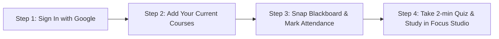

# 🎓 Scholar OS — The All-in-One Smart Academic Assistant for College Students

<div align="center">


[](https://scholardashboard.vercel.app)

[](https://nextjs.org/)
[](https://www.typescriptlang.org/)
[](https://tailwindcss.com/)
[](https://deepmind.google/technologies/gemini/)
[](https://developers.google.com/identity)
[](LICENSE)

<br/>

**Tired of using 6 different apps for your college life? Scholar OS combines everything a university student needs into one clean, smart dashboard.**

[✨ What is Scholar OS?](#-what-is-scholar-os-in-simple-words) · [💡 Problems It Solves](#-why-do-you-need-this-real-college-problems-solved) · [🧭 Dashboard Tour](#-quick-tour-what-each-part-of-the-website-does) · [🚀 How to Use (Step-by-Step)](#-how-to-use-scholar-os-in-4-simple-steps) · [💻 Run Locally](#-how-to-run-this-project-locally)

</div>

---

## 💡 What is Scholar OS in Simple Words?

**Scholar OS is a free, smart web app that acts as your personal college assistant.**

Instead of having:
- Photos of blackboards lost in your phone gallery 📱
- An attendance calculator app with ads 📊
- A separate flashcard or note-taking app 📝
- A sticky note for assignment deadlines 📋
- A Pomodoro timer app for studying ⏱️

**Scholar OS puts all of them in one place on your phone and laptop**, synced together automatically in real-time.

---

## 🎯 Why Do You Need This? (Real College Problems Solved)

Here are the real everyday college struggles Scholar OS solves for you:

| Everyday College Struggle | How Scholar OS Solves It | Which Feature to Use |
| :--- | :--- | :--- |
| **"I take blackboard photos in class, but they just rot in my gallery."** | Snaps or uploads blackboard photos and turns them into clean typed notes, step-by-step solved math/code problems, and revision flashcards in 3 seconds. | 📸 **Blackboard Vision Studio** |
| **"I'm terrified of falling below 75% attendance and getting debarred."** | Tracks your attendance for each subject and tells you **exactly how many classes you can safely bunk** or **how many you must attend** to get back above 75%. | 🎓 **75% Attendance & Bunk Simulator** |
| **"I want a 9.0+ CGPA, but math is confusing."** | Enter your current grades, pick your dream CGPA target, and it calculates the exact semester GPA you need in upcoming semesters. | 📈 **10.0 CGPA Target Calculator** |
| **"I forget what the teacher taught yesterday and cram right before exams."** | Gives you a quick 2-minute daily AI quiz based on your actual subjects. If you get it wrong, it shows memory cards with formulas so you never forget. | 🎯 **Daily AI Concept Quiz** |
| **"I keep forgetting assignment and lab submission deadlines."** | A visual task board where you can see what is pending, what you are working on, and what is due next. | 📋 **Assignment Kanban Board** |
| **"I get distracted by phone notifications while studying."** | Built-in 25-minute focus timer with relaxing background sounds (Alpha brainwaves, rain sounds, brown noise) to help you get into deep focus. | ⏱️ **Focus Studio & Ambient Sounds** |
| **"I snap photos on my phone in class, but study on my laptop at home."** | Log in with Google, and everything you do on your phone appears instantly on your laptop. | ☁️ **Instant Cloud Sync** |

---

## 🧭 Quick Tour: What Each Part of the Website Does

Here is a simple map of what each section on the dashboard is for:

```
┌─────────────────────────────────────────────────────────────────────────────────────────┐
│                                    SCHOLAR OS DASHBOARD                                 │
├──────────────────────────┬─────────────────────────────┬────────────────────────────────┤
│  📸 Blackboard Vision    │  🎯 Daily AI Quiz           │  🎓 Attendance & Bunk Calc     │
│  Turns chalkboard photos │  2-minute daily practice    │  Tells you if you can bunk or  │
│  into typed notes & cards│  to remember your subjects  │  must attend to stay above 75% │
├──────────────────────────┼─────────────────────────────┼────────────────────────────────┤
│  📈 CGPA Target Dial     │  📋 Assignment Board        │  🌿 120-Day Habit Matrix       │
│  Shows what GPA you need │  Keeps track of lab sheets, │  Track daily study, coding,    │
│  for honors graduation   │  homework, and due dates    │  attendance, and hydration     │
├──────────────────────────┴─────────────────────────────┴────────────────────────────────┤
│                      ⏱️ Focus Studio (Pomodoro Timer + Rain & Alpha Waves)               │
│                      Put on your headphones and study for 25 minutes in flow            │
└─────────────────────────────────────────────────────────────────────────────────────────┘
```

---

### 1. 📸 Blackboard & Assignment Vision Studio
* **What it does**: Takes any picture of a lecture blackboard, whiteboard, or assignment sheet and uses AI (Google Gemini 2.5 Flash) to read it.
* **What you get**:
  - 📝 **Clean Typed Notes**: Formatted summaries with headers, bullet points, and code blocks.
  - 🔢 **Step-by-Step Solutions**: Complex math derivations, algorithms, or SQL queries broken down step-by-step.
  - 🗂️ **Revision Flashcards**: Interactive cards to flip and test yourself.
  - 💬 **Ask Doubts (AI Tutor)**: A chat box to ask questions like *"Explain step 2 like I'm 5"* or *"Convert this to Python"*.
* **Saved History**: All your lecture snapshots are saved in a shelf so you can search them during exam revision.

---

### 2. 🎯 Daily AI Concept Quiz & Voice Check-In
* **What it does**: A quick daily 2-minute oral or multiple-choice test based on your actual semester subjects.
* **Why it helps**: Stops you from forgetting concepts and eliminates last-night exam panic.
* **Cool features**:
  - 🔊 **Voice Assistant**: Reads the question and explanation aloud to you like a professor.
  - ❌ **No fake grades**: If you pick the wrong answer, it shows you why and opens a study flashcard so you learn from your mistake immediately.
  - ⚡ **1-Tap Focus Sprint**: Finish your quiz and immediately jump into a 25-minute study sprint.

---

### 3. 🎓 Course Attendance & 75% Bunk Simulator
* **What it does**: Real-time attendance calculator tailored to university rules.
* **Why it's a lifesaver**:
  - Shows your attendance percentage in Green (Safe), Yellow (Caution), or Red (Danger).
  - 🟢 **Safe to Bunk**: Tells you: *"You can safely miss the next 4 classes and stay above 75%"*.
  - 🔴 **Deficit Alert**: Tells you: *"You must attend the next 6 classes in a row to get back to 75%"*.
  - Lets you log **Present**, **Absent**, or **Class Cancelled** with just one tap.

---

### 4. 📈 10.0 CGPA Benchmark & Trajectory Engine
* **What it does**: Helps you plan your academic grades on the standard 10.0 GPA scale.
* **How it helps**:
  - Enter your past semester GPAs.
  - Set your graduation target (e.g. `9.00 CGPA` for First Class with Distinction).
  - It calculates the exact average SGPA you must score in your remaining semesters.

---

### 5. 📋 Assignment Kanban Board
* **What it does**: A simple 4-column visual board (`Backlog` ➔ `In Progress` ➔ `Under Review` ➔ `Completed`).
* **How it helps**:
  - Add your upcoming lab submissions, term papers, and projects.
  - Color-code them by urgency (`Urgent`, `High`, `Medium`, `Low`).
  - Never miss a submission deadline again.

---

### 6. 🌿 120-Day Study Habit Matrix
* **What it does**: A GitHub-style daily consistency tracker across a 120-day semester.
* **Tracks 4 key college habits**:
  1. 📚 **Deep Study** (Target: 4 hours)
  2. 💻 **Coding & Problem Solving** (Target: 2 hours)
  3. 🏫 **Class Attendance** (Attended all classes today)
  4. 💧 **Health & Hydration** (Drank water & stayed healthy)
* **Goal**: Fill the grid with glowing green tiles and build an unbroken study streak!

---

### 7. ⏱️ Focus Studio & Ambient Sound Synthesizer
* **What it does**: A built-in study timer with relaxing audio frequencies.
* **Built-in Sounds (No internet audio needed)**:
  - 🧠 **Alpha Waves (10 Hz)**: Scientifically tuned to boost focus and memory.
  - 🌧️ **Rain Ambience**: Calming background rain.
  - 📻 **Brown Noise**: Drowns out noisy roommates or coffee shop chatter.
  - 💻 **Coding Flow**: Electronic rhythm for problem solving.

---

### 8. ☁️ Instant Cloud Sync & Google Sign-In
* **What it does**: Keeps your data saved and synced between your phone, tablet, and laptop.
* **Why it matters**:
  - Snap a blackboard on your phone during class ➔ View the clean notes on your laptop when you get home.
  - Zero fake dummy data: brand-new accounts start clean with your real subjects.

---

## 🚀 How to Use Scholar OS in 4 Simple Steps

Getting started takes less than 60 seconds:



### Step 1: Open the App & Sign In
- Go to [scholardashboard.vercel.app](https://scholardashboard.vercel.app).
- Click **"Sign in with Google"** in the top right corner.

### Step 2: Add Your Semester Subjects
- Go to the **Attendance** section and click **"+ Add Course"**.
- Enter your course codes (e.g., `CS301 - Data Structures`, `MATH201 - Linear Algebra`, `DBMS - Database Systems`).

### Step 3: Use it in Class
- When the professor fills the blackboard, tap the **Camera icon** in the app and take a picture.
- Click **"Analyze"** and let the AI generate your lecture notes and flashcards.
- Tap **`+ Present`** to log your attendance for the day.

### Step 4: Revise in the Evening
- Open your dashboard on your laptop.
- Take your **2-minute Daily Concept Quiz**.
- Start a **25-minute Focus Sprint** with Alpha Waves audio to knock out your assignments!

---

## 💻 How to Run This Project Locally (For Developers)

If you are a developer, student, or contributor who wants to run this code on your computer:

### 1. Prerequisites
- [Node.js](https://nodejs.org/) (Version 18 or higher)
- [Git](https://git-scm.com/)
- A free [Google Gemini API Key](https://aistudio.google.com/)

### 2. Clone the Repository
```bash
git clone https://github.com/KaiX-Jr/scholar-os.git
cd scholar-os
```

### 3. Install Dependencies
```bash
npm install
```

### 4. Add Environment Variables
Create a file named `.env.local` in the project root and add:
```env
# Gemini API Key (for Blackboard Vision & AI Quiz)
GEMINI_API_KEY="your_gemini_api_key_here"

# Upstash Redis (for cloud sync across devices)
UPSTASH_REDIS_REST_URL="https://your-database.upstash.io"
UPSTASH_REDIS_REST_TOKEN="your_upstash_redis_rest_token"

# Google Sign-In Client ID
NEXT_PUBLIC_GOOGLE_CLIENT_ID="your_google_client_id.apps.googleusercontent.com"
```

### 5. Start the App
```bash
npm run dev
```
Open **[http://localhost:3000](http://localhost:3000)** in your browser!

---

## 🛠️ Tech Stack Behind Scholar OS

- **Frontend**: [Next.js 16 (App Router)](https://nextjs.org/) & [React 19](https://react.dev/)
- **Styling**: [Tailwind CSS](https://tailwindcss.com/) + Lucide Icons
- **AI Vision Engine**: [Google Gemini 2.5 Flash](https://deepmind.google/technologies/gemini/)
- **State Management**: [Zustand](https://zustand.docs.pmnd.rs/) with Local & Cloud Persistence
- **Cloud Database**: [Upstash Redis](https://upstash.com/)
- **Audio Synthesizer**: Web Audio API (real-time frequency synthesis)
- **Math Formatting**: [KaTeX](https://katex.org/) (LaTeX rendering)
- **Hosting**: [Vercel](https://scholardashboard.vercel.app)

---

## 👨‍💻 Creator & Maintainer

**Swapnoneel Mondal** ([@KaiX-Jr](https://github.com/KaiX-Jr))
- GitHub: [https://github.com/KaiX-Jr](https://github.com/KaiX-Jr)
- Repository: [https://github.com/KaiX-Jr/scholar-os](https://github.com/KaiX-Jr/scholar-os)
- Live Website: [https://scholardashboard.vercel.app](https://scholardashboard.vercel.app)

---

## 📄 License

This project is open-source under the [MIT License](LICENSE).

<div align="center">

**Give your college life a super-upgrade with Scholar OS!**

[⭐ Star this Repo on GitHub](https://github.com/KaiX-Jr/scholar-os) · [🚀 Launch Scholar OS](https://scholardashboard.vercel.app)

</div>
